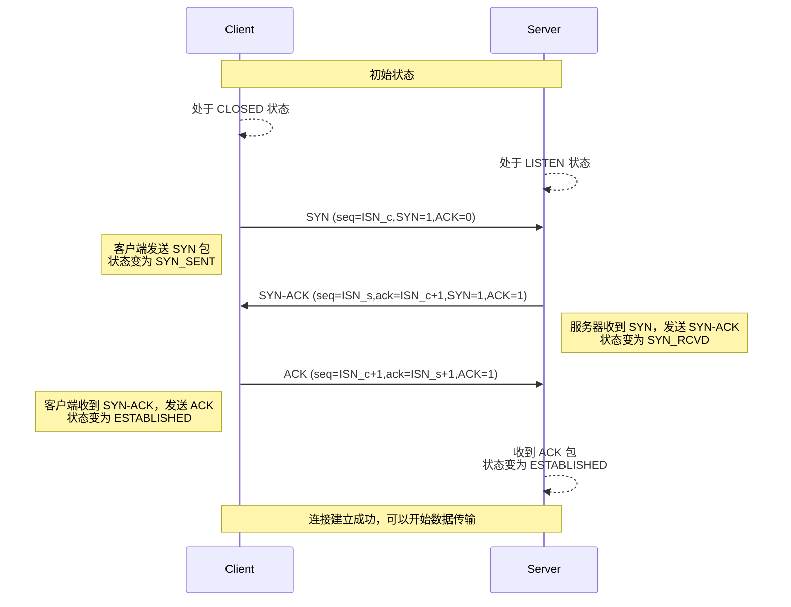
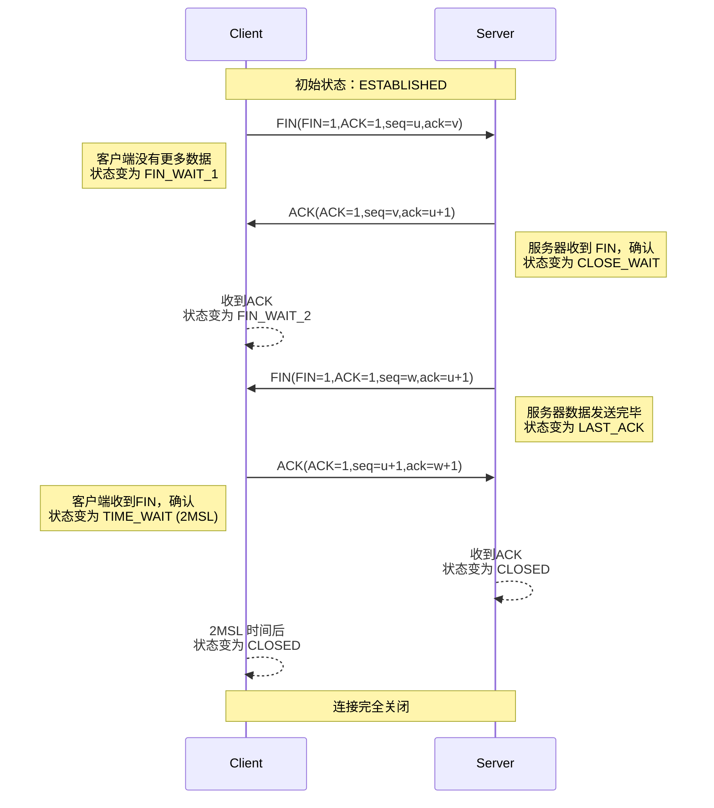

# TCP知识记录以及面试相关

> with Gemini

## 认识TCP和UDP

### OSI模型和TCP/IP协议簇

**OSI模型**(*Open Systems Interconnection Model*)是一个概念性的框架，由国际标准化组织(ISO)于1980年代提出，旨在定义**不同计算机系统互联的标准**。它将复杂的**网络通信过程**划分为七个抽象的、逻辑上独立的层，每层都有特定的功能。这七层从上到下分别是

1. **应用层**(*Application Layer*)：最靠近用户的一层，为应用程序提供网络服务。例如HTTP、FTP、SMTP等协议就在这一层
2. **表示层** (*Presentation Layer*)： 负责**数据格式的转换**、数据加密和解密、数据压缩和解压。确保不同系统间的数据表示方式兼容
3. **会话层** (*Session Layer*)： 负责建立、管理和终止应用程序之间的会话连接。它提供对话控制和同步。
4. **传输层** (*Transport Layer*)： 提供**端到端（进程到进程）**的数据传输服务，负责数据的分段、重组、错误检查和流量控制。TCP和UDP就属于这一层
5. **网络层** (*Network Layer*)： 负责数据包的**路由和寻址**，将数据从源主机传输到目标主机。IP协议就在这一层
6. **数据链路层** (*Data Link Layer*)： 负责在网络的物理链路上无差错地传输数据帧，处理物理地址（MAC地址）、错误检测和流量控制
7. **物理层** (*Physical Layer*)： 最底层，负责传输比特流，定义了物理介质（如电缆、光纤）、传输速率、电压等**物理特性**

实际的互联网并没有完全按照OSI的七层结构来实现。**TCP/IP协议簇** 是互联网的实际标准，它是一个更加简洁的**四层或五层模型**，其功能与OSI模型是对应的。以下是TCP/IP协议簇的四层模型以及它们与OSI模型的对应关系

1. **应用层** (*Application Layer*)
   1. 对应OSI模型的应用层、表示层和会话层
   2. 包含所有应用层协议，如HTTP、FTP、SMTP、DNS等
2. **传输层** (*Transport Layer*)
   1. 对应 OSI 模型的**传输层**，负责端到端的数据传输
   2. 主要协议是**TCP**(*Transmission Control Protocol*)和**UDP**(*User Datagram Protocol*)
3. **网络层** (*Internet Layer*)
   1. 对应OSI模型的网络层，负责数据包的路由和跨网络的寻址
   2. 核心协议是**IP**(*Internet Protocol*)
4. **网络接口层** (*Network Interface Layer*)/**数据链路层** (*Data Link Layer*)
   1. 对应 OSI 模型的**数据链路层和物理层**。处理网络硬件和物理传输细节，如 Ethernet、Wi-Fi 等协议。

TCP/IP协议簇的各层之间遵循严格的**协议栈**关系

* **封装** (*Encapsulation*)：数据从应用层向下传递时，每一层都会给数据添加一个自己的**协议头** (*Header*)或**协议尾**（*Trailer*）。这个过程就像套娃一样，每一层都把自己所需的信息“封装”在数据外面。例如，TCP层会添加TCP头，IP层会添加IP头
* **解封装** (*Decapsulation*)：封装的反过程，数据从物理层向上传递时，每一层会剥离（解析）自己对应的协议头/尾，并将内部数据传递给上一层，直到最终到达应用层
* **层次独立性**：每层只关心自己的功能，并且只与紧邻的上下层进行交互。例如，传输层不需要知道数据链路层如何将比特流转换成电信号，它只需要将处理好的数据交给网络层即可
* 服务提供者与服务使用者：**下一层为上一层提供服务**。例如，网络层为传输层提供数据包的路由服务，传输层不需要关心路由的具体实现

#### 为什么分层思想很重要？

分层思想是网络协议设计的核心，其重要性体现在以下几个方面：

1. 降低复杂性（分治）：将复杂的网络通信问题分解成若干个更小的、更易于管理和理解的子问题。每层只关注一个特定功能，使得设计、实现和调试变得简单
2. 模块化和独立性：每层都是一个独立的模块，**修改某一层的功能不会影响其他层的设计**。例如，可以更换底层的数据链路技术（如从以太网切换到Wi-Fi），而上层的应用协议（如HTTP）无需改变。
3. 促进标准化：分层为不同厂商开发和实现网络产品提供了**统一的接口和规范**。只要遵循同一层协议的约定，不同厂商的设备就可以互相通信。这正是互联网能够全球互联的基础
4. 易于维护和升级：当需要对网络协议进行升级或修复漏洞时，通常只需要修改或替换受影响的层，而不需要重新设计整个系统
5. 灵活性：允许在不影响其他层的情况下替换或添加新的协议。例如，可以在传输层选择使用TCP（可靠传输）或UDP（不可靠传输），以适应不同的应用需求

理解分层思想，就像理解软件工程中的模块化设计一样，它是构建大型、复杂、可维护系统的基本原则。分层设计的指导思想是分治，把网络通信的大问题分解为更小的、可解的问题，这里就降低了问题的复杂性。解决各个小问题（对应各个层，这是适合网络通信问题的划分方式，因为这套模型的扩展是靠对消息的多层封装）更适合使用模块化的设计，耦合度更低，而模块化会更容易将对外交互接口定义清楚，这也促进了各层规范标准化的需求，并且模块化之后，整套系统更易于维护和升级，因为各层之间相互独立，所以维护和升级不会涉及整个系统的更新，而这些因素都构成了整套模型的**灵活性**

### TCP/UDP/QUIC的核心特性

#### TCP

TCP 是一种**面向连接的、可靠的、基于字节流的传输层协议**。它的设计目标是在不可靠的IP网络上提供可靠的数据传输服务

TCP协议的特性

1. **面向连接**(*Connection-Oriented*)
   1. 在数据传输之前，发送方和接收方必须先通过**三次握手**建立连接
   2. 数据传输完成后，需要通过**四次挥手**释放连接
   3. 连接的建立和释放都需要消耗时间和资源，一旦建立连接（高成本），后续的数据传输效率较高
2. **可靠传输**(*Reliable Transmission*）
   1. 确保数据能够**无差错、不丢失、不重复、按顺序**地从发送端传输到接收端
   2. 实现可靠性的主要机制包括
      1. **序列号**(*Sequence Number*)和**确认应答**(*Acknowledgment Number*)，保证数据按序到达和不重复
      2. **超时重传**(*Retransmission Timeout - RTO*)，发现丢包后进行重传
      3. **校验和**(*Checksum*)，检测数据在传输过程中是否损坏
      4. **肯定确认**(*Positive Acknowledgment*)，接收方收到数据后必须发送确认
3. **面向字节流**(*Byte Stream-Oriented*)
   1. TCP不关心应用层数据的具体边界，它将应用层提交的数据视为一串**无结构的字节流**
   2. TCP会根据自身的需求（如MSS，最大报文段长度）将字节流分割成**报文段**(*Segment*)进行传输
   3. 这就导致了**粘包/拆包问题**，需要应用层自行处理消息边界
4. **全双工**(*Full-Duplex*)
   1. TCP连接允许数据在**两个方向上同时传输**，互不干扰
   2. 这也是四次挥手的原因之一，因为每个方向的传输都需要独立关闭
5. **流量控制**(*Flow Control*)
   1. TCP通过**滑动窗口机制**实现流量控制
   2. 接收方通过在ACK报文中告知发送方其当前的**接收窗口**(*Advertised Window*)大小，来限制发送方的发送速率。目的是防止发送方发送数据过快，导致接收方缓冲区溢出，从而造成数据丢失
6. **拥塞控制**(*Congestion Control*)
   1. TCP 通过一系列算法（慢启动、拥塞避免、快速重传、快速恢复）来动态调整发送速率，以适应网络的负载能力。目的是防止网络过载（拥塞），从而避免大量丢包和性能下降
   2. 关注的是整个网络的状况，而不是单一接收方的处理能力

#### UDP

UDP是一种**无连接的、不可靠的、基于数据报的传输层协议**（相对于TCP记忆）。它提供的是**尽力而为**(*best-effort*) 的传输服务。

UDP协议的特性

1. **无连接**(*Connectionless*)
   1. 在数据传输之前无需建立连接。发送方可以直接向接收方发送数据报
   2. 传输完成后，也无需释放连接
   3. 优点：开销小，传输速度快，适用于*对延迟敏感的应用*
2. **不可靠传输**(*Unreliable Transmission*)
   1. UDP不保证数据报的完整性、不丢失、不重复、按顺序
   2. 如果数据报在传输过程中丢失、乱序或损坏，UDP**不会进行重传或通知上层应用**
   3. 错误检测仅限于可选的**校验和**（如果启用）
3. **基于数据报**(*Datagram-Oriented*)
   1. UDP传输的基本单位是**数据报**(*Datagram*)
   2. 每个数据报都是一个独立的、带有完整头部信息的报文（有格式），包含**源端口和目的端口**
   3. UDP会保留应用层消息的边界，即发送方发送一个数据报，接收方就接收一个完整的数据报，**没有粘包/拆包问题**
4. **无流量控制**(*No Flow Control*)
   1. UDP不提供流量控制机制。发送方可以以任意速率发送数据，不考虑接收方的处理能力
   2. 优点：简单高效。缺点：可能导致接收方缓冲区溢出而丢包
5. **无拥塞控制**(*No Congestion Control*)
   1. UDP不提供拥塞控制机制。发送方不关心网络是否拥塞，会持续发送数据
   2. 优点：在某些场景下（如实时音视频，允许少量丢包以保证流畅性）可以获得更低的延迟。缺点：可能加剧网络拥塞
6. **头部开销小**(*Small Header Overhead*)
   1. UDP报文头部固定为8字节（源端口、目的端口、长度、校验和）
   2. 对比：TCP报文头部至少20字节。UDP的头部开销远小于TCP，因此在传输小数据量时效率更高

---

#### TCP vs UDP

| 特性       | TCP                                    | UDP                                          |
| :--------- | :--------------------------------------------------------------------- | :-------------------------------------------------------------------- |
| **连接性** | 面向连接（三次握手，四次挥手）                                         | 无连接                                                                |
| **可靠性** | 可靠传输（保证数据完整、不丢、不重、按序）                                   | 不可靠传输（尽力而为）                                                |
| **传输方式** | 字节流                                                  | 数据报                                                     |
| **消息边界** | 无（存在粘包/拆包问题）                                                | 有（保留消息边界）                                                    |
| **拥塞控制** | 有                                                                     | 无                                                                    |
| **流量控制** | 有                                                                     | 无                                                                    |
| **头部开销** | 至少20字节                                                           | 固定8字节                                                           |
| **传输速度** | 相对较慢（因控制机制复杂）                                             | 相对较快（开销小，无复杂控制）                                        |
| **适用场景** | 对数据完整性、可靠性要求高的应用（HTTP, FTP, Email, SSH, 数据库）      | 对实时性要求高，允许少量丢包的应用（DNS, DHCP, VoIP, 实时音视频, 游戏） |

#### QUIC

QUIC(Quick UDP Internet Connections)是Google开发的一种**基于UDP的多路复用传输协议**，旨在解决TCP在现代互联网应用中遇到的一些**性能瓶颈**，特别是在其与HTTP/2结合使用时。它被设计为下一代HTTP(HTTP/3)的底层传输协议

QUIC出现的原因(TCP的痛点)

1. **队头阻塞**(*Head-of-Line Blocking*)问题：TCP在一个连接上，即使使用了多路复用（如 HTTP/2），如果一个数据包丢失，整个连接上的所有后续数据包（即使它们属于不同的请求/响应流）都必须等待丢失的包被重传和确认，才能继续处理。这会严重影响并发性能
2. **连接建立延迟**：TCP的三次握手需要1个**RTT**(*Round Trip Time*)延迟。如果加上TLS加密握手，通常需要2-3个 RTT才能开始传输应用数据。
3. **连接迁移困难**：TCP连接由四元组（源IP、源端口、目的IP、目的端口）唯一标识。当用户设备在不同网络（如从 Wi-Fi切换到蜂窝网络）之间切换时，IP地址会改变，导致TCP连接断开，需要重新建立
4. **内核实现和升级困难**：TCP协议栈通常实现在操作系统内核中，其更新和部署非常缓慢，难以快速迭代和优化

QUIC协议的核心特性

1. 基于UDP实现
   1. QUIC运行在UDP之上，绕过了操作系统内核中TCP协议栈的限制，使得协议的迭代和部署更加灵活和快速
   2. 利用UDP的无连接特性，减少了连接建立的开销
2. 更快的连接建立
   1. QUIC可以在0-RTT或1-RTT内完成连接建立和加密握手，大大减少了延迟
   2. 0-RTT意味着如果客户端之前连接过服务器，并在本地缓存了会话信息，可以直接发送应用数据，无需任何额外握手
3. 解决队头阻塞问题
   1. QUIC在单个连接上实现了**多路复用 (Multiplexing)**
   2. 每个逻辑流都是独立的，即使一个流中的数据包丢失，也只会影响该流，而不会阻塞其他流的数据传输
4. 连接迁移 (Connection Migration)
   1. QUIC连接通过一个**Connection ID**来标识，而不是传统的四元组
   2. 当客户端的IP地址或端口发生变化时，只要Connection ID不变，连接就可以继续保持，而无需重新建立。这对于移动设备尤其重要
5. 内置TLS 1.3加密
   1. QUIC将TLS 1.3集成到协议握手过程中，所有数据默认加密，提供了更好的安全性
   2. 加密握手与传输握手合并，进一步降低了延迟
6. 前向纠错(Forward Error Correction, FEC) (可选)
   1. QUIC可以选择性地使用FEC，通过发送冗余数据来恢复部分丢失的数据包，减少重传的需要，在高丢包率网络中表现更好
7. 更灵活的拥塞控制
   1. 由于在用户空间实现，QUIC可以更灵活地集成和测试新的拥塞控制算法（如BBR），并根据应用需求进行定制

* QUIC已经成为**HTTP/3**的底层传输协议
* 它是未来互联网传输协议发展的一个重要方向

### 端口号的作用

端口号是传输层的一个核心概念。假设你家里的地址是IP地址，邮件会投递到你家。但是如果你家里有很多人（比如你的父母、兄弟姐妹和你），寄给你的信怎么才能准确送到你手里，而不是你爸妈手里呢？这就需要一个**房间号**或者**姓名**来区分

在网络中，IP地址负责定位一台主机（计算机），而**端口号**(*Port Number*)则负责定位一台主机上运行的特定应用程序或服务进程。它的作用主要体现在以下几个方面

1. **区分不同的应用进程**(*Process Identification*)：当数据包到达一台主机时，主机需要知道这个数据是发送给哪个应用程序的。端口号就是用来做这个区分的。例如，Web服务器通常监听80端口（HTTP）或443端口（HTTPS），邮件服务器监听25端口（SMTP），而你的聊天程序可能会使用一个随机的高位端口。客户端发送请求时，会指定目的IP地址和目的端口号，这样**服务器就能将请求路由到正确的服务进程**。同样，服务器响应时，会使用客户端的源端口号作为目的端口号，将响应发送回客户端的正确进程
2. **多路复用**(*Multiplexing*) 与**解多路复用**(*Demultiplexing*)
   1. 多路复用：在发送端，多个应用进程（不同的端口号）可以将数据通过同一个传输层协议（TCP或UDP）发送出去，共用一个IP地址。传输层会将不同应用的数据“打包”起来，加上各自的端口号信息交给网络层
   2. 解多路复用：在接收端，传输层收到数据后，会根据数据包中的目的端口号，将数据准确地分发给等待这个数据包的相应应用进程。这是端口号最核心的功能之一
3. **标识通信的端点**(*Endpoint Identification*)：在TCP/IP协议栈中，一个完整的通信会话由一个**套接字**(*Socket*) 来标识。一个套接字通常由(IP地址:端口号)组成。例如，一个TCP连接由四元组(源IP地址:源端口号, 目的IP地址:目的端口号)唯一标识。

#### 端口号的分类

端口号是一个**16位的无符号整数**，范围从0到65535，通常分为三类：

* **熟知端口**(*Well-Known Ports*)：0~1023，它们是为一些最常用的网络服务（如HTTP、FTP、DNS、SMTP等）预先定义和保留的。这些端口号是全球统一的，由IANA(Internet Assigned Numbers Authority)管理
  * 20/21：FTP
  * 22：SSH
  * 23：Telnet
  * 25：SMTP
  * 53：DNS
  * 80：HTTP
  * 110：POP3
  * 143：IMAP
  * 443：HTTPS
* **注册端口**(*Registered Ports*)：1024~49151，它们可以分配给用户进程或应用程序，但通常不被系统进程使用。这些端口号也可以被注册给特定的应用使用，但不如熟知端口那么严格。许多常用的应用程序会选择使用这个范围内的端口
* **动态/私有端口**(*Dynamic/Private Ports*)：49152~65535。它们是为客户端应用程序**动态分配**的端口号。当客户端程序发起连接时，通常会从这个范围中随机选择一个未被占用的端口作为源端口。服务器端一般也会从这个范围中选择端口作为其临时服务端口，尤其是在响应客户端请求时

## 连接管理

### TCP的连接管理

#### 三次握手（*Three-way Handshake*）

TCP 的三次握手是指在客户端和服务器之间建立一个TCP连接时，需要交换**三个数据包**。这个过程确保了通信双方都能正常发送和接收数据。

##### 详细过程：`SYN`、`SYN-ACK`、`ACK`的报文交换顺序和状态变迁

下面是三次握手的时序图

首先定义术语

* 客户端：发起连接请求的一方
* 服务器：接收连接请求并等待连接的一方

两端的初始状态

* 客户端：处于 `CLOSED` 状态
* 服务器：处于 `LISTEN` (监听) 状态，等待客户端的连接请求

握手步骤

1. 第一次握手：客户端发送`SYN`包(*SYN - Synchronize Sequence Numbers*)
    * 动作：客户端想要建立连接，向服务器发送一个SYN报文段
    * 报文内容
        * 设置`SYN`标志位为`1`
        * 选择一个随机的**初始序列号**(*Initial Sequence Number, ISN_c*)，将其放入**序列号字段**(*Sequence Number*)
        * （可选）携带其他TCP选项，如**最大报文段长度**(*MSS*)等
    * 状态变迁：客户端发送SYN报文后，进入`SYN_SENT`(同步已发送)状态。这意味着客户端等待服务器的确认
2. 第二次握手：服务器发送`SYN-ACK`包(*SYN-ACK - Synchronize-Acknowledge*)
    * 动作：服务器收到客户端的`SYN`报文后，确认可以接受连接请求
    * 报文内容：
        * 设置`SYN`标志位为`1`(表示同意连接)。
        * 设置`ACK`标志位为`1`(表示确认)。
        * 发送自己的一个随机**初始序列号**(*ISN_s*)，放入序列号字段
        * 发送对客户端`SYN`报文的确认号(*ACK = ISN_c + 1*)，放入**确认号字段**
    * 状态变迁：服务器发送`SYN-ACK`报文后，进入`SYN_RCVD`(同步已接收)状态。这意味着服务器等待客户端的最终确认
3. 第三次握手：客户端发送`ACK`包(*ACK - Acknowledge*)
    * 动作：客户端收到服务器的`SYN-ACK`报文后，确认已收到服务器的响应
    * 报文内容：
        * 设置`ACK`标志位为`1`。
        * 发送对服务器`SYN`报文的确认号(*ACK = ISN_s + 1*)，放入确认号字段
        * 序列号字段通常是上一次发送的序列号（即*ISN_c + 1*）
    * 状态变迁：
        * 客户端发送`ACK`报文后，立即进入`ESTABLISHED`(已建立连接)状态
        * 服务器收到客户端的 ACK 报文后，也进入`ESTABLISHED`(已建立连接)状态

这里涉及到TCP报文的几个部分

* 标志位(`SYN`,`ACK`)是布尔值，表示某种控制功能是否启用（通常是0或1）
* 字段(`seq`,`ack`) 是数值，包含具体的序列号或确认号
  * 确认号(*Acknowledgment Number - ack*)：这个字段表示**发送方**期望接收方下一次发送的数据的序列号。也就是说，它确认了发送方已经成功收到了从接收方发来的、直到`ack - 1`为止的所有数据
  * `ACK`标志位为`1`，才表示确认号字段的值是有效的，需要被处理。 即使一个报文没有携带应用数据，只要`ACK`标志位为`1`，它的`ack`字段依然有意义（建立连接够的所有包中`ACK`都被设为`1`，所以`ack`都必须被处理）

至此，TCP 连接正式建立，客户端和服务器可以开始互相发送和接收应用数据了

##### 为什么是三次握手？理解其必要性

三次握手是TCP建立可靠连接的**最少步骤**，多一次或少一次都可能导致问题。其核心目的是为了防止已失效的连接请求报文段突然传到服务器，从而产生错误。

我们通过反例来理解三次握手的必要性

如果是“两次握手”？

1. 客户端发送`SYN`(ISN_c)。
2. 服务器收到`SYN`，回复`SYN-ACK`(ISN_s, ack=ISN_c+1)。服务器认为连接已建立。
3. （缺失第三次握手）

* 问题：假设客户端发送的第一个`SYN`报文滞留在网络中，很久之后才到达服务器。客户端可能因为超时而重发`SYN`，并与服务器成功建立了一个新的连接并完成数据传输，甚至已经关闭了该连接。此时，滞留的旧`SYN`报文才到达服务器。服务器收到这个“过时”的`SYN`，会立即回复`SYN-ACK`，并**认为连接已建立**，然后分配资源等待客户端发送数据。但客户端已经关闭了旧连接，不会理会这个 SYN-ACK，更不会发送数据
* 结果：服务器白白等待，并且为这个实际上已失效的连接分配和浪费了资源。两次握手无法区分“旧连接请求”和“新连接请求”，无效连接请求

为什么不能是“四次握手”？

四次握手虽然也能建立连接，但没有必要，因为它增加了额外的延迟和资源开销，而**不能提供更多的可靠性保障**。三次握手已经足够确保双方都确认了彼此的收发能力

三次握手的核心作用总结

* 第一次握手：客户端发出请求，服务器确认了**客户端的发送能力**
* 第二次握手：服务器回复确认，客户端确认了**服务器的接收能力**和**服务器的发送能力**
* 第三次握手：客户端回复最终确认，服务器确认了**客户端的接收能力**

通过这三步，双方都明确了自己和对方的发送与接收能力，确保了双向通信的准备就绪，有效地避免了历史连接请求的干扰和资源的浪费

##### 相关状态：`CLOSED`、`LISTEN`、`SYN_SENT`、`SYN_RCVD`、`ESTABLISHED`

在三次握手过程中，TCP 连接的状态会发生以下变化：

* `CLOSED`(关闭)：这是TCP连接的初始状态，表示没有连接活动。客户端和服务器在连接建立前都处于这个逻辑状态
* `LISTEN`(监听)：服务器程序启动后，会调用 `listen()` 函数，进入 `LISTEN` 状态，表示服务器已经准备好接收来自客户端的连接请求
* `SYN_SENT`(同步已发送)：客户端发送了`SYN`报文后，进入此状态，等待服务器的SYN-ACK响应
* `SYN_RCVD`(同步已接收)：服务器收到客户端的`SYN`报文并发送`SYN-ACK`报文后，进入此状态，等待客户端的`ACK`确认
* `ESTABLISHED`(已建立连接)：客户端收到`SYN-ACK`后发送`ACK`，服务器收到`ACK`后，双方都进入`ESTABLISHED`状态。此时，连接已完全建立，可以进行数据传输

#### 四次挥手（*Four-way Handshake*）

四次挥手是指在TCP连接的终止阶段，客户端和服务器之间需要交换**四个数据包**来彻底关闭连接。之所以需要四次，是因为TCP连接是全双工的，这意味着数据可以在两个方向上独立传输和关闭。

##### 四次挥手的详细过程

以下是四次挥手过程的时序图

* `u`是客户端在`FIN`报文前的最后一个发送的序列号+1
* `v`是服务器在发送`ACK`报文前的最后一个发送的序列号+1
* `w`是服务器在发送`FIN`报文前的最后一个发送的序列号+1

对四次挥手过程中的实体及初始状态定义如下

* 客户端：发起关闭请求的一方
* 服务器：被请求关闭的一方
* 初始状态：客户端和服务器都处于`ESTABLISHED`状态，可以进行正常的数据传输

挥手步骤如下

1. 第一次挥手：客户端发送`FIN`包(*FIN - Finish*)
   * 动作：客户端决定关闭连接（例如，用户关闭了浏览器标签页，或者应用程序完成了数据传输）。它向服务器发送一个`FIN`报文段，表示客户端**不再有数据要发送给服务器了**，但仍然可以接收来自服务器的数据
   * 报文内容：
       * 设置`FIN`标志位为`1`
       * 设置`ACK`标志位为`1`(因为连接已建立，所有报文都带`ACK`)
       * `seq`字段：当前发送方（客户端）的序列号
       * `ack`字段：对服务器已接收数据的确认号
   * 状态变迁：客户端发送`FIN`报文后，进入`FIN_WAIT_1`(等待 FIN)状态。这意味着客户端正在等待服务器的确认
2. 第二次挥手：服务器发送`ACK`包
   * 动作：服务器收到客户端的`FIN`报文后，立即发送一个`ACK`报文段作为响应，确认收到了客户端的关闭请求。此时，服务器可能还有数据要发送给客户端
   * 报文内容：
       * 设置`ACK`标志位为`1`
       * `seq` 字段：当前发送方（服务器）的序列号
       * `ack` 字段：对客户端 FIN 报文的确认号（通常是客户端 FIN 报文的`seq + 1`）
   * 状态变迁：
       * 服务器发送`ACK`报文后，进入`CLOSE_WAIT`(关闭等待)状态。这意味着服务器已经收到了客户端的关闭请求，并通知客户端“已经关闭了它的发送方向，但我可能还有数据要发给你”。服务器如果还有数据要发送，可以在这个状态下继续发送
       * 客户端收到服务器的`ACK`报文后，进入`FIN_WAIT_2`(等待最后`FIN`)状态。这意味着客户端等待服务器发送它自己的`FIN`报文
3. 第三次挥手：服务器发送`FIN`包
   * 动作：当服务器的应用程序也完成了所有数据的发送，并准备关闭自己的发送方向时，它会向客户端发送一个 `FIN`报文段
   * 报文内容：
       * 设置`FIN`标志位为`1`
       * 设置`ACK`标志位为`1`
       * `seq`字段：当前发送方（服务器）的序列号
       * `ack`字段：对客户端已接收数据的确认号
   * 状态变迁：服务器发送`FIN`报文后，进入`LAST_ACK`(最后确认)状态。这意味着服务器正在等待客户端的最终 ACK 确认
4. 第四次挥手：客户端发送`ACK`包
      * 动作：客户端收到服务器的`FIN`报文后，发送一个`ACK`报文段作为响应，确认收到了服务器的关闭请求
      * 报文内容：
          * 设置`ACK`标志位为`1`
          * `seq`字段：当前发送方（客户端）的序列号
          * `ack`字段：对服务器`FIN`报文的确认号（通常是服务器`FIN`报文的 `seq + 1`）
      * 状态变迁：
          * 客户端发送`ACK`报文后，进入`TIME_WAIT`(时间等待)状态。客户端会在这个状态下停留一段指定的时间(通常是**`2MSL`**)，之后才会进入`CLOSED`状态。`TIME_WAIT`状态是四次挥手中最特殊也是面试高频考点之一
          * 服务器收到客户端的 ACK 报文后，立即进入`CLOSED`(关闭)状态

至此，TCP 连接彻底关闭，资源被释放

##### 为什么是四次挥手？理解其必要性

之所以需要四次挥手，是因为TCP连接是**全双工**的。这意味着连接的每一方都独立地管理其发送和接收的数据流

* 第一次和第二次挥手：**客户端的发送方向**关闭。客户端通知服务器“我没数据要给你了”，服务器确认收到。此时，服务器仍然可以向客户端发送数据（半关闭状态）
* 第三次和第四次挥手：**服务器的发送方向**关闭。服务器通知客户端“我没数据要给你了”，客户端确认收到

简单来说，当客户端发送`FIN`时，它只是说“我这边的数据发完了”。服务器收到`FIN`后，会回复`ACK`，表示“我知道你没数据发了”。但服务器可能还有数据没有发完，所以它不会立即发送`FIN`，只有当服务器也把数据发完了，它才会发送自己的`FIN`。所以，`FIN`和`ACK`通常是分开的两次发送，而不是像建立连接时的`SYN`和`ACK`那样合并发送。即双方何时关闭接收流是取决于对方是否发了`FIN`包，所以不能保证服务器一定会第一个`ACK`和它自己的`FIN`合并发送

这确保了两个方向的数据流都能优雅地关闭，而不会丢失任何传输中的数据

##### 相关状态：`ESTABLISHED`、`FIN_WAIT_1`、`CLOSE_WAIT`、`FIN_WAIT_2`、`LAST_ACK`、`TIME_WAIT`、`CLOSED`

我们再次整理在四次挥手过程中涉及到的 TCP 状态：

* `ESTABLISHED`(已建立连接)：连接处于正常的数据传输状态
* `FIN_WAIT_1`(等待`FIN`)：客户端发送了`FIN`报文，等待服务器的`ACK`确认
* `CLOSE_WAIT`(关闭等待)：服务器收到了客户端的`FIN`报文，并发送了`ACK`。此时服务器的应用程序可以继续发送数据，等待上层应用发出关闭连接的指令。这是服务器端等待应用关闭自己发送端的状态
* `FIN_WAIT_2`(等待最后`FIN`)：客户端收到了服务器对`FIN`的`ACK`后等待服务器发送它自己的`FIN`报文
* `LAST_ACK`(最后确认)：服务器发送了`FIN`报文，等待客户端的最终`ACK`确认
* `TIME_WAIT`(时间等待)：客户端发送了最后一个`ACK`报文后，进入此状态，等待`2MSL`时间，以确保服务器收到最终的`ACK`并处理网络中可能滞留的报文
* `CLOSED`(关闭)：连接已完全终止，资源被释放

#### `TIME_WAIT`状态

##### `TIME_WAIT` 状态的必要性与存在意义

`TIME_WAIT`状态是主动关闭连接的一方（即发送最后一个`ACK`的一方）在发送完`ACK`报文后，进入的一个特殊等待状态。这个状态会持续一段固定的时间，通常是**2MSL**

`TIME_WAIT` 状态的主要存在意义有两个：

1. 确保最后一个`ACK`报文能够到达服务器
    * 在四次挥手的最后一步，客户端发送的最后一个`ACK`报文可能会在网络中丢失
    * 如果没有`TIME_WAIT`状态，客户端发送完`ACK`之后就直接进入`CLOSED`状态，并释放了端口。此时，如果服务器没有收到客户端的`ACK`，它会超时并**重传**第三次挥手时的`FIN`报文
    * 由于客户端已经处于 `CLOSED` 状态，它会忽略或响应一个`RST`（*Reset*）报文，这可能会导致服务器端收到 `RST`后出现错误
    * 而有了`TIME_WAIT`状态，客户端即使已经发送了ACK，它仍然**保持着该连接的端口和状态**。如果它又收到了服务器重传的`FIN`报文，它会**重新发送`ACK`**，确保服务器能够正确地关闭连接
2. 防止旧连接的报文段在网络中被新连接接收
    * 假设一个客户端和服务器之间的一个连接被关闭了，并且这个连接使用的端口号被立即重用，建立了一个新的连接
    * 如果网络中还滞留着属于旧连接的、延迟到达的数据报文段，这些报文段可能会被新连接接收，导致数据混乱
    * `TIME_WAIT`状态的存在，确保了这个连接使用的端口在**`2MSL`**时间内不会被再次使用。这足以让网络中所有属于旧连接的延迟报文段都**自然消逝**（下一章节解释），从而避免它们对新连接造成干扰

简而言之，`TIME_WAIT`状态是为了保证**TCP连接的可靠性**和**有序性**，是TCP协议在复杂网络环境下自我保护的一种机制

##### 2MSL(*Maximum Segment Lifetime*)的意义

`MSL`是指一个TCP报文段在网络中的**最大生存时间**。它是一个理论值，表示报文段从发送端到达接收端所需的最长时间，即使网络中存在路由环路，报文段最终也会因为其`TTL` (*Time To Live*) 字段过期而被丢弃

* `2MSL` 的时间长度是为了保证**一个报文段来回一趟所需的足够时间**
* 第一个`MSL`：确保客户端发送的最后一个`ACK`能够到达服务器
* 第二个`MSL`：确保服务器重传的`FIN`报文（如果第一个`ACK`丢失）能够到达客户端
* 这样，客户端在`2MSL`时间后进入 `CLOSED` 状态，就可以确保网络中不再存在任何属于该旧连接的报文段了。

RFC 793建议的`MSL`值为2分钟。但在现代系统中，这个值通常被配置为30秒、1分钟等更小的值，以减少`TIME_WAIT` 状态的持续时间

##### `TIME_WAIT`过多的影响及解决方案

尽管`TIME_WAIT`状态对于TCP的可靠性至关重要，但如果系统中存在大量的`TIME_WAIT`状态，也可能带来问题，尤其是在高并发、短连接的应用场景中（如 Web 服务器）

* 端口资源耗尽：每个`TIME_WAIT`状态的连接都会占用一个端口。如果服务器作为主动关闭方（例如关闭空闲连接），并且每秒处理大量短连接，可能会导致端口资源被快速耗尽，新的连接无法建立
* 性能开销：操作系统需要为每个`TIME_WAIT`连接维护一个**控制块**，这会消耗一定的内存资源

解决方案

在某些特定的场景下，可以通过一些操作系统级别的配置来优化或规避`TIME_WAIT`带来的问题。

1. `SO_REUSEADDR`选项
    * 作用：这是一个套接字选项，允许一个处于`TIME_WAIT`状态的端口被立即重用，用于绑定一个新的套接字
    * 使用场景：主要用于**服务器端**，当服务器重启时，如果上一个实例的某些端口还处于`TIME_WAIT`状态，设置此选项可以立即使用这些端口，避免重启失败
    * 副作用：这个选项**并没有**解决旧报文干扰新连接的问题。因为它只是允许端口重用，并没有缩短 `TIME_WAIT`的时间。在某些情况下，这可能会导致新连接收到旧连接的延迟报文
2. 缩短`TIME_WAIT`的时间
    * 在Linux系统中，可以通过修改`/proc/sys/net/ipv4/tcp_tw_reuse`和`/proc/sys/net/ipv4/tcp_tw_recycle`这两个内核参数来**复用或快速回收**`TIME_WAIT`状态
      * `tcp_tw_reuse`：只对客户端有效，允许将`TIME_WAIT`状态的端口用于新的连接，但要求新的连接的序列号大于旧连接
      * `tcp_tw_recycle`：在Linux 4.12版本之后已被移除，因为它在NAT环境下存在严重问题。在旧版本中，它可以更激进地快速回收`TIME_WAIT`状态的套接字。
    * 需要注意：调整这些参数会牺牲一部分可靠性来换取性能，因此需要谨慎使用，特别是当网络中存在大量NAT设备时
3. 负载均衡和连接池
    * 在高并发场景下，使用**负载均衡器**或**连接池**是更优的解决方案
    * 负载均衡器可以将请求分发到多个服务器，分摊端口压力。这是一种横向扩展的方案
    * 连接池通过维护长连接来减少短连接的建立和关闭次数，从而从根本上减少`TIME_WAIT`状态的产生。这需要转化问题，而不是简单地解决问题

`TIME_WAIT` 状态是TCP协议为了**可靠性**而做出的设计权衡。虽然在某些高并发场景下它会带来资源压力，但通常不应该被简单地禁用。正确的做法是理解它的存在意义，并根据具体应用场景，通过适当的配置或架构设计来优化，而不是粗暴地绕过它

### UDP的连接管理

UDP是非面向连接的协议，所有的连接管理机制需要在应用层实现

## 可靠性保障机制

### TCP的可靠性保障机制

#### 序列号与确认应答

这是TCP可靠性的基石，它们协同工作，确保数据**不丢失、不重复且按序到达**

* **序列号**(*Sequence Number* - `seq`)
  * 作用：序列号是发送方对数据进行编号的依据。每一个TCP报文段都会有一个序列号，它标识了该报文段中第一个数据字节在整个数据流中的位置
  * 工作原理：在连接建立时，双方会协商一个初始序列号(ISN)。之后发送的每一个数据报文段，其序列号都会在上一个报文段的序列号基础上，加上**已发送的字节数**。这使得接收方能够对收到的乱序报文段进行排序，并识别重复的报文段
* **确认应答**(*Acknowledgment Number* - `ack`)
  * 作用：确认号是接收方用来告诉发送方“我收到了哪些数据”的。它表明接收方**期望收到的下一个字节的序列号**
  * 工作原理：每当接收方收到一个报文段后，会发送一个确认报文，报文中的`ack`字段会设置为已收到的数据流的**下一个**预期序列号。例如，如果收到了序列号从100到199的数据，那么确认号就会是`200`，表示“我已经收到了 199之前的所有数据，我期望你接下来给我发从200开始的数据”
* **累计确认**(*Cumulative Acknowledgment*)
  * 概念：TCP使用的是**累计确认**机制。这意味着一个确认号 `N` 并不只是确认了序列号`N-1`的数据，而是确认了从连接开始到序列号`N-1`为止的所有数据
  * 优点：这种机制可以减少确认报文的数量。即使发送方发送了多个报文段，接收方也只需要发送一个确认报文，就可以一次性确认之前所有已收到的数据。这大大提高了效率

#### 超时重传(*Retransmission Timeout* - RTO)

序列号和确认号解决了“有序、不丢包”的问题，但如果网络环境不好，报文段真的丢失了怎么办？超时重传就是为此而生的

* 机制
    1. 发送方发送一个报文段后，会启动一个定时器
    2. 如果定时器在到期之前收到了该报文段的确认应答，那么定时器就会被取消
    3. 如果定时器到期，但发送方没有收到确认应答，它就认为该报文段已经丢失，并重新发送该报文段。
* RTO动态调整
  * **RTO**是指从发送报文到重发报文所等待的超时时间。如果RTO固定不变，就会有问题：如果RTO太短，会发生不必要的重传，加重网络负担；如果RTO太长，会影响传输效率
  * 由于网络状况是动态变化的（时延、拥塞等），TCP采用动态的RTO算法。它会根据每一次通信的**往返时间**(*RTT, Round Trip Time*)来动态地调整RTO的值
  * **RTT**是指从发送数据到收到对应确认的时间。TCP会测量并记录每次报文段的RTT，然后使用**加权平均算法**来估算一个**平滑的RTT**(*Smoothed RTT*)，并据此来计算RTO。这个计算会考虑RTT的波动性，以确保RTO的值既不过短也不过长

当一个数据包发出去后，在规定的`RTO`时间内都没有收到任何确认，发送方会认为这个数据包已经彻底丢失了。这种“完全沉默”通常意味着网络中发生了严重的拥塞，甚至可能导致多个数据包连续丢失。面对这种情况，TCP认为之前对网络带宽的乐观估计（即`cwnd`和`ssthresh`的值）是完全错误的，因此必须采取最保守的策略

1. 将`ssthresh`设置为当前`cwnd`的一半
2. 将`cwnd`直接重置为1个MSS
3. 重新进入“慢启动”阶段，从头开始探索网络容量

#### 校验和(*Checksum*)

校验和是TCP协议提供的最简单、最基础的可靠性保障机制

* 目的
  * 校验和是一个用于检测数据**完整性**的简单算法。它确保报文段在传输过程中没有因为**比特错误**（如电磁干扰）而损坏
* 工作原理
    1. 发送方：在发送数据之前，对整个报文段（包括头部和数据）执行一个简单的计算，得到一个校验和值，并将其放入报文段的校验和字段
    2. 接收方：收到报文段后，也会执行同样的计算。
    3. 校验：如果计算结果与报文段中携带的校验和字段的值不匹配，就表明数据在传输过程中发生了错误
    4. 处理：接收方会丢弃这个损坏的报文段，TCP依赖超时重传机制来等待发送方重发正确的数据

需要注意的是，校验和只是一种**弱校验**，它能检测出大部分错误，但不能保证100%的准确性。在应用层面，通常还会使用更强的校验算法（如MD5或SHA-256）来确保数据的完整性

正是因为 TCP 提供了上述一系列复杂的机制，才使其成为一个可靠的协议，适用于对数据完整性要求极高的应用，如文件传输、网页浏览等。

### UDP的可靠性保障机制

和TCP提供的可靠性保障机制对比

* 序列号和确认应答：无。UDP的数据报是独立的，没有编号和确认机制
* 超时重传：无。UDP不会重传丢失的报文
* 校验和：有，但它是**可选的**。如果发送方没有计算校验和，那么校验和字段会被全零填充。

## 传输效率与控制机制

### TCP的传输效率与控制机制

传输效率与控制机制保证了TCP在提供可靠性的同时，也能高效、健康地传输数据

#### 滑动窗口(*Sliding Window*)

滑动窗口是TCP提高传输效率的核心手段。它允许发送方在**不等待每个数据包确认的情况下，连续发送多个数据包**

* 目的
  * 提高传输效率：如果发送方每发送一个数据包都必须等待确认，那么网络延迟会严重影响吞吐量。滑动窗口允许发送方“一次性”发送一批数据，极大地减少了等待时间
  * 实现流量控制：**滑动窗口的大小由接收方控制**，从而限制了发送方的发送速率，防止接收方缓冲区溢出
* 窗口大小：发送窗口与接收窗口
  * 发送窗口(*Send Window*)：发送方维护的窗口。它决定了发送方**当前还能发送多少字节的数据**。发送窗口的大小等于`min(接收窗口, 拥塞窗口)`，这是流量控制和拥塞控制共同作用的结果
  * 接收窗口(*Receive Window*)：接收方维护的窗口。它决定了接收方**还有多少空闲缓冲区可以接收数据**。接收方通过在`ACK`报文中将这个值告诉发送方，来实现流量控制
* 零窗口问题(*Zero Window Problem*)
  * 原因：当接收方的应用程序处理数据太慢，导致其接收缓冲区满载时，接收方会向发送方通告一个`接收窗口 = 0` 的`ACK`报文
  * 处理：发送方收到“零窗口”通知后，会**暂停发送数据**。但是，为了避免死锁（如果通知窗口变大的`ACK`报文丢失），发送方会启动一个**持久计时器**（*Persist Timer*）。当计时器到期后，发送方会发送一个**窗口探测报文**（*Window Probe*），询问接收方窗口是否已变大。这个过程会一直持续，直到接收方发送一个窗口不为零的`ACK`报文

#### 流量控制(*Flow Control*)

流量控制是一个**点对点**（端到端）的机制

* 目的：协调**发送方和接收方的速率**，防止发送方发送数据过快，导致接收方的缓冲区溢出
* 实现方式：完全依赖于**滑动窗口**。接收方通过`ACK`报文中的`接收窗口`字段来告诉发送方自己还能接收多少数据。发送方根据这个值来调整自己的发送速率，确保不超过接收方的处理能力

#### 拥塞控制(*Congestion Control*)

拥塞控制是一个**全局性**的机制

* 目的：协调**发送方和整个网络的速率**，防止发送数据过多，导致网络中的路由器和交换机队列溢出，从而引起全局性的性能下降
* 拥塞窗口(*Congestion Window* - cwnd)
  * TCP引入了一个名为**拥塞窗口**的概念，它由发送方动态维护
  * 拥塞窗口的大小是发送方能够向网络中发送的**最大数据量**
  * 拥塞控制算法的核心就是动态调整`cwnd`的值
* 四种核心算法(*TCP Reno/Cubic*)
  1. 慢启动(*Slow Start*)
     * 目的：在连接刚建立或网络空闲时，快速探测网络的带宽
     * 原理：`cwnd`的初始值为一个较小的值（例如1或2个MSS）。每当收到一个ACK，`cwnd`就会**指数级增长**
     * 为什么叫“慢启动”：虽然是指数增长，但相对于带宽来说，它的增长过程是从一个很小的值开始的，所以被称为“慢启动”
  2. 拥塞避免(*Congestion Avoidance*)
     * 目的：当`cwnd`达到一个预设的阈值（`ssthresh`，慢启动阈值）后，进入拥塞避免阶段
     * 原理：`cwnd`的增长模式从指数增长变为**线性增长**。每当收到一个ACK，`cwnd` 缓慢增加
     * 为什么要线性增长：这是为了在不引起网络拥塞的前提下，继续探索网络的容量
  3. 快速重传(*Fast Retransmit*)
     * 目的：在没有等到超时的情况下，快速重传丢失的数据包
     * 原理：当发送方收到**三个重复的ACK**（即确认号都相同的ACK报文）时，它就会立即**重传**那个被重复确认的数据包，而无需等待`RTO`超时。这大大减少了丢包后的恢复时间
  4. 快速恢复(*Fast Recovery*)
     * 目的：在快速重传之后，避免重新进入慢启动阶段，从而更温和地恢复传输
     * 原理：发送方在执行快速重传后，会调整`cwnd`和`ssthresh`的值，并继续以线性增长的方式恢复传输，而不是像超时重传那样将`cwnd`重置为1
     * 处理方式
       * 将`ssthresh`设置为当前cwnd的一半
       * 将`cwnd`设置为`ssthresh+3`个MSS
       * 直接进入“拥塞避免”阶段

发送方在接收到某个报文的`ACK`之前，必须具备重发这个包的能力。这要归功于TCP内部的一个关键机制——**发送缓冲区**（*Send Buffer*）

* 发送缓冲区的角色
  * 当应用程序将数据交给TCP层发送时，这些数据并不会直接被丢弃。它们首先会被**复制**一份，并放入一个名为发送缓冲区的内存区域
  * 发送方将缓冲区中的数据打包成报文段，并发送到网络上
  * TCP会持续地在发送缓冲区中保留这些已发送但尚未被确认的数据
* 重发的能力
  * 当发送方收到对应报文的`ACK`后，它会认为这个数据已经安全到达，此时才会将这个数据从发送缓冲区中删除
  * 如果定时器超时（RTO）或收到重复的ACK（快速重传），发送方可以立即从发送缓冲区中找到并重新发送这个丢失的报文，而不需要向应用程序请求数据

> 发送缓冲区通常使用环形缓冲区（双指针，头指针和ACK确认报文指针，需要提前分配空间，静态结构）实现。还可以使用链表，但是占用内存更大，需要存储指针，并且容易产生内存碎片

#### 流量控制与拥塞控制的区别与联系

| 对比项         | **流量控制 (Flow Control)** | **拥塞控制 (Congestion Control)** |
| :------------- | :-------------------------------------------------------------- | :---------------------------------------------------------------- |
| 关注点 | **接收方**的处理能力                                            | **整个网络**的负载                                                |
| 控制对象 | 协调**发送方和接收方**的速率                                    | 协调**发送方和网络**的速率                                        |
| 实现机制 | 接收窗口（`rwnd`）                                                | 拥塞窗口（`cwnd`）、慢启动、拥塞避免、快速重传、快速恢复等算法 |
| 核心问题 | 防止接收方**缓冲区溢出** | 防止网络**拥塞崩溃** |
| 作用范围 | 点对点（端对端）                                                | 全局性                                                            |

流量控制和拥塞控制共同决定了TCP的发送速率。发送方最终的发送窗口大小是两者中较小的一个，即`实际发送窗口大小 = min(接收窗口, 拥塞窗口)`。这样，TCP既能保证不撑爆接收方的缓冲区，又能防止自己对整个网络造成太大的负担

### UDP的传输效率与控制机制

* UDP没有流量控制。它只管发送数据，不关心接收方是否能处理，这可能导致接收方丢包
* UDP也没有拥塞控制。这意味着UDP应用会以应用允许的最大速度发送数据，完全不考虑网络状况。这在某些场景下（如实时音视频）可以降低延迟，但在网络拥塞时，会加剧丢包，甚至导致“拥塞崩溃”

## 常见问题与优化

### TCP的常见问题与优化

#### TCP粘包与拆包(*TCP Segmentation*)

TCP粘包与拆包是由于TCP的**面向字节流**特性而引起的问题

* 产生原因
  * TCP面向字节流：TCP传输的单位是字节流，它没有消息边界的概念。当应用程序向TCP缓冲区写入数据时，TCP会根据自身的发送策略（如缓冲大小、Nagle算法等）来决定何时将缓冲区的数据打包成一个或多个报文段发送
  * Nagle算法：Nagle算法的引入是为了**提高网络利用率**，它会延迟发送小数据包，将它们合并成一个更大的报文段。这可能导致本应独立发送的两个小消息被“粘”在一起
  * 接收方处理速度：接收方应用程序从TCP缓冲区读取数据时，可能一次性读入多个消息的数据，或分多次读取一个完整的消息
* 解决方案
  * **定长消息**：协议规定每个消息的长度都是固定的。接收方每次读取固定长度的数据即可
  * **分隔符**：在每个消息的末尾添加一个特殊的分隔符（例如 `\r\n`）。接收方读取数据直到遇到分隔符，就认为一个消息结束
  * **TLV协议头**(*Type-Length-Value*)： 最常用且最可靠的方法。在每个消息前加上一个包含**消息类型和消息长度**的协议头。接收方首先读取协议头，然后根据协议头中的长度字段精确地读取整个消息

#### Nagle算法与延迟ACK

这两个机制都是为了提高TCP连接的效率，但都可能在特定情况下引入延迟

* Nagle算法
  * 目的：减少网络中小数据包的数量，避免**糊涂窗口综合征**（*Silly Window Syndrome*），提高网络吞吐量
  * 原理：
      1. 当一个TCP连接中存在**未确认的数据**时，发送方不会发送新的小数据包（小于MSS），而是将它们缓冲起来
      2. 直到已发送的数据得到确认，或者累积的数据量达到MSS大小，发送方才会将所有缓冲的数据打包成一个报文段发送
* 延迟ACK(*Delayed Acknowledgment*)
  * 目的：同样是为了减少网络流量。它避免了每收到一个数据包就立即发送一个`ACK`，而是将多个`ACK`合并，或者将`ACK`和发送方要发送的数据合并到同一个报文段中
  * 原理：接收方在收到数据后，不会立即发送确认，而是会等待一段时间（通常是几十到几百毫秒），看看是否有数据要发给对方。如果有，就会将ACK和数据一起发送。如果没有，等待时间到了之后再单独发送ACK
* 可能带来的问题
  * 延迟：如果发送方发送了两个小数据包，并且第一个包的`ACK`因为**延迟ACK**没有立即返回，Nagle算法就会一直等待。这会导致第二个数据包的发送延迟，从而影响实时性，在游戏、SSH远程登录等对延迟敏感的应用中，会造成卡顿
* 优化：
  * `TCP_NODELAY`选项：这是最常见的解决方案。应用程序可以设置`TCP_NODELAY`选项来禁用Nagle算法。这会让小数据包立即发送，而无需等待确认。在对延迟有严格要求的应用中，通常会启用此选项

#### TCP的`keep-alive`机制

* 目的
  * 探测并维护连接的**存活性**，防止连接因为长时间空闲而被网络中的防火墙或NAT设备关闭
  * 当网络中断时，能够及时发现连接中断，避免服务器长时间等待一个已经断开的客户端
* 原理
  * 如果一个TCP连接在一段时间（例如2小时）内没有数据交换，TCP就会发送一个**不包含任何数据的保活探测报文段**
  * 如果收到对方的响应，则认为连接正常，计时器重置
  * 如果没有收到响应，TCP会在一段时间内重试几次
  * 如果重试后仍然没有响应，TCP就会认为连接已断开，并通知应用程序

TCP的`Keep-alive`机制默认是关闭的。开发者使用`setsockopt`函数，设置`SO_KEEPALIVE`来启用这个功能，常用的配置参数如下，在Linux系统上，可以通过`sysctl`来查看和修改

* `net.ipv4.tcp_keepalive_time`：在TCP连接上没有数据传输的**空闲时间**，之后内核将开始发送第一个保活探测报文，通常7200s
* `net.ipv4.tcp_keepalive_intvl`：在未收到保活探测报文的应答时，**后续探测报文发送的间隔时间**，通常75s
* `net.ipv4.tcp_keepalive_probes`：在连接被认为“死亡”之前，内核**发送的探测报文的最大数量**，通常为9

单个套接字可以使用`IPPROTO_TCP`级别的选项来完成配置任务，对应上面的三条配置项的应用级配置是`TCP_KEEPIDLE`、`TCP_KEEPINTVL`、`TCP_KEEPCNT`

#### SYN洪泛攻击(*SYN Flood*)

* 原理
  * 攻击者利用TCP三次握手的漏洞发起攻击
  * 攻击者使用伪造的IP地址向服务器发送大量的`SYN`报文
  * 服务器收到`SYN`后，会为每一个请求分配资源（例如建立一个**连接控制块**），并发送`SYN-ACK`报文
  * 然而，由于攻击者的IP是伪造的，服务器永远无法收到第三次握手所需的`ACK`报文
  * 结果就是服务器的连接队列被大量处于`SYN_RCVD`状态的半开连接耗尽，无法再接受新的合法连接请求，导致拒绝服务
* 防御方法
  * `SYN` Cookies
    * 原理：服务器在收到`SYN`报文后，**不立即分配资源**，而是计算出一个特殊的“cookie”值，将其作为`SYN-ACK` 报文的初始序列号
    * 优点：只有当客户端发送第三次握手的`ACK`报文时（且该报文携带了正确的“cookie”），服务器才会分配资源，从而避免了资源被恶意消耗
  * `SYN` Proxy
    * 原理：在服务器前设置一个代理服务器（如防火墙），由代理服务器代替服务器与客户端进行三次握手。当代理服务器完成握手后，再将连接请求转发给后面的真实服务器
  * 防火墙/IDS(*Intrusion Detection System*)
    * 防火墙可以配置规则来限制来自单个IP地址的 `SYN` 报文数量，或者在识别出攻击模式后主动丢弃相关报文

### UDP的常见问题与优化

UDP本身没有这些复杂的问题。它的问题本质上是其**特性**带来的副作用

1. 不可靠性与乱序
    * 问题：UDP不保证数据报的到达、顺序和完整性
    * 优化/解决方案：需要在应用层实现自己的**可靠性协议**。例如，QUIC协议就是在UDP之上实现了可靠的、有序的传输
2. 没有拥塞控制
    * 问题：UDP流量可能导致网络拥塞，甚至“拥塞崩溃”
    * 优化/解决方案
        * 应用程序需要自己实现**拥塞控制算法**。例如，某些实时音视频协议会根据丢包率、延迟等指标来动态调整码率
        * 使用基于UDP的协议（如QUIC），它们内置了先进的拥塞控制算法（如`BBR`），能够更好地适应网络状况
3. 大报文分片
    * 问题：UDP数据报在IP层可能被分片，任何一个分片丢失都会导致整个数据报需要被重传
    * 优化/解决方案：在应用层限制UDP数据报的大小，使其不超过`MTU`(*Maximum Transmission Unit*)，以避免IP分片

## TCP的扩展与高性能

TCP协议在设计之初，网络带宽和延迟都远低于现在。为了适应高速、高延迟的网络环境，TCP引入了一系列可选的扩展，这些扩展通常在三次握手时通过TCP头部选项进行协商

### 窗口扩大因子(*Window Scale Option*)

* 问题：TCP头部中的窗口大小字段只有16位，最大只能表示65535字节的窗口。在高速网络（高带宽）和高延迟（长距离）的环境下，这个窗口大小太小，会严重限制吞吐量
* 解决方案：窗口扩大因子扩展允许将16位的窗口大小字段左移，从而将窗口大小扩展到最高**1GB**
* 工作原理：在三次握手时，通信双方会交换各自的窗口扩大因子（一个`0-14`的整数）。实际的窗口大小是`窗口大小字段的值 * (2 ^ 窗口扩大因子)`。这使得 TCP 能够充分利用**高带宽延迟积**（*Bandwidth-Delay Product*），实现更高的吞吐量

### 时间戳选项(*Timestamps Option*)

* 问题
    1. 序列号回绕：在高速网络中，32位的序列号可能在很短的时间内用完并重新开始（回绕），导致接收方无法区分新旧数据包
    2. `RTT`估算不准确：当发生重传时，发送方无法区分收到的`ACK`是对原始报文的确认还是对重传报文的确认，导致`RTT`估算不准确。也就是说如果认为接收的`ACK`是原始报文的确认，那么得到的`RTT`就会过大，那么`RTO`也会被调得过大导致传输速率下降
* 解决方案：时间戳选项在TCP头部中添加了两个4字节的字段
  * 发送方时间戳(*TSval*)：发送方在发送报文时的时间戳
  * 回显时间戳(*TSecr*)：接收方将收到的`TSval`原样回传
* 工作原理
  * 解决序列号回绕：接收方可以根据时间戳来判断一个序列号回绕的报文是旧的还是新的
  * 准确估算`RTT`：发送方可以通过比较当前时间与回显的时间戳来精确地计算`RTT`，即使报文发生了重传

### 选择性确认(*Selective Acknowledgment - SACK*)

* 问题：传统的TCP采用**累计确认**机制。如果发送方发送了1、2、3、4、5五个报文段，其中3号报文段丢失，接收方只能持续发送对2号报文的`ACK`。发送方必须等到超时或收到3个重复ACK后，才能重传3号和它之后的所有报文（4、5）。这导致了不必要的重传，降低了效率
* 解决方案：`SACK`扩展允许接收方在`ACK`报文中**精确地告知发送方哪些数据段已经收到*
* 工作原理：当接收方收到1、2、4、5号报文时，它会发送一个`ACK`报文，其中包含
  * 累计确认号：`ACK=3`（表示已收到2号报文）
  * `SACK`选项：告知发送方它已经收到了4号和5号报文
  * 发送方收到这个`SACK`报文后，就知道只有3号报文丢失，只需要重传这一个报文段即可，大大提高了重传效率

在Linux中，`SACK`选项使用`net.ipv4.tcp_sack`开启，设置为`1`，对于开发者来说，在建立TCP连接过程中协商是透明的，只要开启选项后即启用

#### TCP的`BBR`拥塞控制算法

* 问题：传统的拥塞控制算法（如`Cubic`）主要基于**丢包**来判断网络是否拥塞。这在高带宽、大缓存的网络中存在问题：只有当缓冲区满载并开始丢包时，算法才会减速。这会导致网络链路被填满，造成高延迟
* 解决方案：TCP的BBR(*Bottleneck Bandwidth and Round-trip propagation time*)算法通过**估算**网络的**瓶颈带宽**和**最小往返时间**来控制发送速率
* 工作原理
  * `BBR`不再依赖丢包作为拥塞信号
  * 它通过发送**特定模式的数据包**，持续探测网络的**瓶颈带宽**（即网络的最大吞吐量）和**最小RTT**（即网络延迟）
  * 发送速率被限制在**瓶颈带宽**和**最小RTT**的乘积（即带宽延迟积），从而在不填满网络缓冲区的前提下，实现高吞吐量和低延迟
* 优势
  * 在高带宽、高延迟网络中表现更好
  * 避免了传统算法在丢包前填满缓冲区造成的延迟
  * 在有损网络环境中，不会因为丢包而过度减速

## TCP协议面试高频问题

<!-- ### 1\. TCP 三次握手和四次挥手过程，为什么是三次握手和四次挥手？

**答案：**

**三次握手 (Three-way Handshake)：**

1. **SYN (Synchronize Sequence Numbers)**：客户端向服务器发送一个 SYN 包，其中包含客户端的初始序列号 (ISN\_c)。此时，客户端进入 `SYN_SENT` 状态。
2. **SYN-ACK (Synchronize-Acknowledge)**：服务器收到 SYN 包后，发送一个 SYN-ACK 包作为响应。该包中包含服务器的初始序列号 (ISN\_s) 和对客户端 SYN 包的确认号 (ACK\_c = ISN\_c + 1)。此时，服务器进入 `SYN_RCVD` 状态。
3. **ACK (Acknowledge)**：客户端收到 SYN-ACK 包后，向服务器发送一个 ACK 包，其中包含对服务器 SYN 包的确认号 (ACK\_s = ISN\_s + 1)。此时，客户端进入 `ESTABLISHED` 状态。服务器收到 ACK 包后，也进入 `ESTABLISHED` 状态。

**为什么是三次握手？**

三次握手的主要目的是为了防止已失效的连接请求报文段突然又传到服务器，导致服务器错误地建立连接，浪费资源。

* **第一次握手：** 客户端让服务器知道它能发送。
* **第二次握手：** 服务器让客户端知道它能接收，并且能发送。
* **第三次握手：** 客户端让服务器知道它能接收。

通过三次握手，双方都确认了彼此的收发能力，确保连接的可靠建立。如果只有两次握手，可能出现这样的情况：客户端发送的第一个连接请求报文滞留在网络中，客户端超时重传并成功建立连接并关闭。滞留的报文随后到达服务器，服务器会认为这是一个新的连接请求并发送确认，但客户端此时已经关闭，会忽略该确认，服务器则一直等待客户端的数据，造成资源浪费。

**四次挥手 (Four-way Handshake)：**

1. **FIN (Finish)**：客户端发送一个 FIN 包，表示它已经没有数据要发送了，但仍可以接收数据。此时，客户端进入 `FIN_WAIT_1` 状态。
2. **ACK (Acknowledge)**：服务器收到 FIN 包后，发送一个 ACK 包作为响应，确认收到客户端的关闭请求。此时，服务器进入 `CLOSE_WAIT` 状态。客户端收到 ACK 包后，进入 `FIN_WAIT_2` 状态。
3. **FIN (Finish)**：服务器处理完所有数据后，向客户端发送一个 FIN 包，表示它也准备关闭连接。此时，服务器进入 `LAST_ACK` 状态。
4. **ACK (Acknowledge)**：客户端收到服务器的 FIN 包后，发送一个 ACK 包作为响应，确认收到服务器的关闭请求。此时，客户端进入`TIME_WAIT`状态，等待2MSL(*Maximum Segment Lifetime*)时间，确保服务器收到最终的`ACK`包。服务器收到`ACK`包后，进入 `CLOSED` 状态。2MSL 后，客户端也进入 `CLOSED` 状态。

**为什么是四次挥手？**

TCP 是全双工的，每个方向的数据传输是独立的。当一方完成数据发送后，可以发送 FIN 包，但另一方可能还有数据要发送。

* **第一次挥手：** 客户端关闭了发送数据通道。
* **第二次挥手：** 服务器确认客户端的关闭请求，但此时服务器可能还有数据要发送给客户端。
* **第三次挥手：** 服务器数据发送完毕，关闭了发送数据通道。
* **第四次挥手：** 客户端确认服务器的关闭请求。

因此，关闭连接需要等待双方都确认没有数据要发送后才能完成，这导致了四次挥手。

**引用知识源：**

* 《计算机网络》(谢希仁) 第七版 - 第四章 传输层
* [RFC 793 - Transmission Control Protocol](https://datatracker.ietf.org/doc/html/rfc793)

-----

### 2\. TCP 为什么要设计 TIME\_WAIT 状态？它有什么作用？

**答案：**

`TIME_WAIT` 状态是 TCP 四次挥手过程中客户端在发送最后一个 ACK 后进入的状态，持续 2MSL (Maximum Segment Lifetime) 时间。它主要有两个作用：

1. **确保最后一个 ACK 报文能够到达服务器：** 如果客户端发送的最后一个 ACK 报文丢失，服务器将超时重传 FIN 报文。客户端处于 `TIME_WAIT` 状态可以接收到这个重传的 FIN 报文，并重新发送 ACK 报文，确保服务器能够正常关闭连接。
2. **防止“已失效的连接请求报文段”出现在新的连接中：** 如果没有 `TIME_WAIT` 状态，客户端直接进入 `CLOSED` 状态，而此时网络中可能还存在该连接的滞留数据报文。如果立即建立一个新的连接，并且使用了相同的源端口和目的端口，那么这些滞留的报文可能会被新连接接收，导致数据混乱。`TIME_WAIT` 状态的存在，确保了旧连接的所有报文段都在网络中消逝，避免对新连接造成干扰。

**引用知识源：**

* 《计算机网络》(谢希仁) 第七版 - 第四章 传输层
* [RFC 793 - Transmission Control Protocol](https://www.google.com/search?q=https://datatracker.ietf.net/doc/html/rfc793)

-----

### 3\. TCP 如何保证可靠传输？

**答案：**

TCP 通过以下机制来保证可靠传输：

1. **序列号 (Sequence Number) 和确认应答 (Acknowledgment Number)：**

      * TCP 为每个发送的字节都赋予一个序列号。
      * 接收方收到数据后，会发送一个确认应答 (ACK)，ACK 号表示接收方期望收到的下一个字节的序列号。
      * 发送方通过比对序列号和确认应答，判断数据是否被正确接收。

2. **超时重传 (Retransmission Timeout - RTO)：**

      * 发送方在发送数据后会启动一个定时器。如果在定时器到期之前没有收到接收方的确认应答，发送方会认为数据丢失，并重新发送该数据。
      * RTO 的计算是一个动态过程，会根据网络的往返时间 (RTT) 进行调整，以适应不同的网络状况。

3. **滑动窗口 (Sliding Window)：**

      * TCP 使用滑动窗口协议来提高传输效率。发送方不需要等待一个报文段的确认后才发送下一个，而是可以在窗口大小的范围内连续发送多个报文段。
      * 窗口大小由接收方的接收能力和网络的拥塞状况共同决定。接收方通过在 ACK 报文中携带窗口大小 (Advertised Window) 来告知发送方其当前的接收缓冲区大小。

4. **流量控制 (Flow Control)：**

      * 接收方通过滑动窗口机制来控制发送方的发送速率，避免发送方发送过快导致接收方缓冲区溢出。接收方会在 ACK 报文中更新其接收窗口的大小，发送方根据这个窗口大小调整发送速率。

5. **拥塞控制 (Congestion Control)：**

      * TCP 通过拥塞控制机制来避免网络拥塞。主要包括四种算法：
          * **慢启动 (Slow Start)：** 在连接建立初期，拥塞窗口 (cwnd) 缓慢增长，以避免突然向网络注入大量数据。
          * **拥塞避免 (Congestion Avoidance)：** 当拥塞窗口达到慢启动阈值 (ssthresh) 后，拥塞窗口线性增长。
          * **快速重传 (Fast Retransmit)：** 当发送方收到三个重复的 ACK (Dup ACK) 时，不等超时就立即重传丢失的报文段。
          * **快速恢复 (Fast Recovery)：** 配合快速重传，当发生快速重传时，拥塞窗口减半，然后线性增长。

6. **校验和 (Checksum)：**

      * TCP 在发送数据时会计算校验和，并在报文头部包含该校验和。接收方收到数据后，会重新计算校验和并与报文头部的校验和进行比较，以检测数据在传输过程中是否发生损坏。

**引用知识源：**

* 《计算机网络》(谢希仁) 第七版 - 第四章 传输层
* [RFC 793 - Transmission Control Protocol](https://datatracker.ietf.org/doc/html/rfc793)
* [RFC 2001 - TCP Slow Start, Congestion Avoidance, Fast Retransmit, and Fast Recovery Algorithms](https://datatracker.ietf.org/doc/html/rfc2001)

-----

### 4\. TCP 流量控制和拥塞控制的区别与联系？

**答案：**

**区别：**

* **目的不同：**

  * **流量控制 (Flow Control)：** 是为了解决发送方发送速率过快导致接收方缓冲区溢出的问题。它关注的是端到端的通信量，即发送方和接收方之间的匹配。
  * **拥塞控制 (Congestion Control)：** 是为了解决整个网络中，多个数据流竞争有限资源导致网络性能下降的问题。它关注的是全局的网络状况，避免网络过载。

* **控制主体不同：**

  * **流量控制：** 主要由接收方控制，通过窗口大小 (Advertised Window) 告知发送方其接收能力。
  * **拥塞控制：** 主要由发送方控制，通过调节拥塞窗口 (cwnd) 来限制发送速率，以适应网络的负载能力。

* **衡量指标不同：**

  * **流量控制：** 基于接收方的接收缓冲区大小。
  * **拥塞控制：** 基于网络中的丢包、延迟等现象来判断拥塞程度。

**联系：**

流量控制和拥塞控制都是为了确保 TCP 连接的稳定和高效传输，但它们关注的层面不同，共同协作来优化数据传输。发送方的实际发送窗口是流量控制窗口和拥塞控制窗口中的较小值，即：

$$EffectiveWindow = \min(AdvertisedWindow, CongestionWindow)$$

这意味着发送方发送的数据量既不能超过接收方的处理能力 (流量控制)，也不能超过网络的承载能力 (拥塞控制)。

**引用知识源：**

* 《计算机网络》(谢希仁) 第七版 - 第四章 传输层

-----

### 5\. TCP 粘包和拆包问题，如何解决？

**答案：**

**TCP 粘包 (Sticking Packet)：**

TCP 粘包是指发送方发送的多个数据包在接收方可能被合并成一个更大的数据包接收，或者接收方一次读取到了多个逻辑上独立的数据包。例如，发送方分两次发送了 `Hello` 和 `World`，但接收方一次性收到了 `HelloWorld`。

**TCP 拆包 (Splitting Packet)：**

TCP 拆包是指发送方发送的一个完整数据包，在接收方可能被拆分成多个小数据包接收。例如，发送方发送了 `HelloWorld`，但接收方第一次收到 `Hello`，第二次收到 `World`。

**产生原因：**

1. **TCP 是面向字节流的协议：** TCP 不知道上层应用发送的数据的边界，它只是将上层应用的数据看作一串无边界的字节流。
2. **Nagle 算法：** Nagle 算法是为了减少网络中发送的小数据包数量，提高网络利用率而设计的。它会将多个小数据包缓存起来，等到一定条件满足时再一起发送。这可能导致发送方将多个独立的数据包“粘”在一起发送。
3. **发送方缓冲区优化：** 发送方可能会将多次写入的数据合并成一个 TCP 段发送，以提高效率。
4. **接收方缓冲区优化：** 接收方可能一次从缓冲区读取多个 TCP 段，或者一次读取的字节数大于一个完整的数据包。

**解决方案：**

解决 TCP 粘包/拆包问题的核心是**明确应用层消息的边界**。常见的解决方案有：

1. **定长消息：** 定义一个固定长度的消息格式。发送方不足固定长度则补齐，接收方每次读取固定长度的数据。这种方式简单，但灵活性差，且可能浪费带宽。

2. **消息边界符：** 在消息的末尾添加一个特殊的结束符（例如换行符 `\n`，或自定义的特殊字符序列）。接收方根据这个结束符来判断一个消息的结束。需要注意边界符不能出现在消息内容中。

3. **消息头 + 消息体 (TLV - Type-Length-Value)：** 这是最常用和推荐的方式。

      * **消息头：** 包含消息的长度信息（通常是一个固定长度的字段，如 4 字节的整数）。
      * **消息体：** 实际的数据内容。
        发送方先发送消息头，再发送消息体。接收方先读取消息头，根据消息头中的长度信息再读取相应长度的消息体。

4. **自定义协议解析器：** 对于更复杂的场景，可以设计一个状态机来解析协议。根据当前读取到的字节和协议的规范，判断是否已经接收到一个完整的消息。

**引用知识源：**

* 《UNIX 网络编程 卷 1：套接字联网 API》(Richard W. Stevens) - 第六章 基本 TCP 套接字编程
* 网络编程相关书籍和资料

-----

### 6\. TCP 的拥塞控制算法有哪些？各自的原理是什么？

**答案：**

TCP 拥塞控制主要包括以下四种算法，它们协同工作以避免网络拥塞：

1. **慢启动 (Slow Start)：**

      * **原理：** 在连接建立初期或发生超时重传后，为了探测网络的承载能力，拥塞窗口 (cwnd) 会从一个较小的值（通常为 1 或 2 个 MSS，Maximum Segment Size）开始，每收到一个 ACK，cwnd 就增加一个 MSS。
      * **特点：** 拥塞窗口呈指数级增长，增长速度很快。
      * **目的：** 快速找到网络容量的瓶颈。

2. **拥塞避免 (Congestion Avoidance)：**

      * **原理：** 当拥塞窗口达到慢启动阈值 (ssthresh) 后，慢启动过程结束，进入拥塞避免阶段。此时，每当收到一个 RTT (Round Trip Time) 内的所有 ACK 后，cwnd 才会增加一个 MSS。
      * **特点：** 拥塞窗口呈线性增长，增长速度较慢。
      * **目的：** 避免过快地增加发送速率，减少拥塞发生的可能性。

3. **快速重传 (Fast Retransmit)：**

      * **原理：** 在没有等到重传定时器超时的情况下，如果发送方收到三个或三个以上重复的 ACK (Dup ACK)，就认为对应的报文段丢失了，会立即重传该报文段，而不需要等待 RTO 超时。
      * **特点：** 提高了重传的响应速度，减少了因丢包造成的延迟。
      * **目的：** 快速恢复由于少量丢包引起的性能下降。

4. **快速恢复 (Fast Recovery)：**

      * **原理：** 快速重传之后，进入快速恢复阶段。此时，ssthresh 减半（通常为当前 cwnd 的一半），cwnd 设置为 ssthresh + 3 \* MSS (3 是收到重复 ACK 的数量)。每收到一个重复的 ACK，cwnd 增加一个 MSS。当收到新数据的 ACK 时，cwnd 设置为 ssthresh，然后进入拥塞避免阶段。
      * **特点：** 在检测到丢包时，不像超时重传那样将 cwnd 直接降为 1，而是相对温和地减少 cwnd，并尝试继续发送数据。
      * **目的：** 避免因丢包而导致吞吐量大幅度下降，尽可能保持较高的传输效率。

**引用知识源：**

* 《计算机网络》(谢希仁) 第七版 - 第四章 传输层
* [RFC 2001 - TCP Slow Start, Congestion Avoidance, Fast Retransmit, and Fast Recovery Algorithms](https://datatracker.ietf.org/doc/html/rfc2001)

-----

### 7\. TCP UDP 的区别以及应用场景？

**答案：**

| 特性       | TCP (Transmission Control Protocol)                                    | UDP (User Datagram Protocol)                                          |
| :--------- | :--------------------------------------------------------------------- | :-------------------------------------------------------------------- |
| **连接性** | 面向连接，传输数据前需要建立连接                                       | 无连接，直接发送数据报                                                |
| **可靠性** | 可靠传输，保证数据到达、顺序正确、无重复、无丢失                       | 不可靠传输，不保证数据到达、顺序、无重复、无丢失                      |
| **传输方式** | 字节流 (Byte Stream)，无消息边界                                       | 数据报 (Datagram)，有消息边界                                         |
| **拥塞控制** | 有拥塞控制机制，避免网络拥塞                                           | 无拥塞控制，只管发送，不关心网络状况                                    |
| **流量控制** | 有流量控制机制，避免发送方发送过快导致接收方缓冲区溢出                 | 无流量控制                                                            |
| **首部开销** | 报文首部通常 20 字节（不含可选字段），功能复杂，开销较大               | 报文首部固定 8 字节，开销小                                           |
| **传输速度** | 相对较慢，因为需要进行确认、重传、流量控制、拥塞控制等额外操作         | 相对较快，因为开销小，无需建立连接和复杂的控制机制                    |
| **应用场景** | 对数据完整性、可靠性要求高的场景：HTTP, HTTPS, FTP, SMTP, SSH, Telnet | 对实时性要求高，允许少量丢包的场景：DNS, DHCP, RTP (实时音视频), VoIP |

**应用场景：**

* **TCP 应用场景：**

  * **Web 浏览 (HTTP/HTTPS)：** 需要确保网页内容完整无误地传输。
  * **文件传输 (FTP)：** 保证文件内容的准确性。
  * **邮件发送接收 (SMTP/POP3/IMAP)：** 邮件内容不容丢失或出错。
  * **远程登录 (SSH/Telnet)：** 确保命令和输出的正确性。
  * **数据库连接：** 数据传输的可靠性是核心。

* **UDP 应用场景：**

  * **DNS (域名系统)：** 查询和响应通常较短，且允许少量重传，追求快速响应。
  * **DHCP (动态主机配置协议)：** 用于分配 IP 地址，少量丢包不影响整体功能。
  * **实时音视频传输 (RTP)：** 允许少量丢包以保证流畅性，如果丢失帧可以跳过。
  * **网络游戏：** 对实时性要求高，快速响应比数据完整性更重要，通常会自定义应用层重传机制。
  * **直播：** 丢包会导致画面卡顿，但为了实时性，通常会容忍。

**引用知识源：**

* 《计算机网络》(谢希仁) 第七版 - 第四章 传输层

-----

### 8\. SYN 洪泛攻击 (SYN Flood) 的原理和防御？

**答案：**

**SYN 洪泛攻击原理：**

SYN 洪泛攻击是一种典型的分布式拒绝服务 (DDoS) 攻击。攻击者利用 TCP 三次握手的漏洞，向目标服务器发送大量的 SYN 包，但不完成三次握手的最后一步（不发送 ACK 包）。

1. **攻击者发送大量 SYN 包：** 攻击者伪造源 IP 地址，向目标服务器发送大量的 SYN 请求。
2. **服务器响应 SYN-ACK 并分配资源：** 服务器收到 SYN 包后，会为每个 SYN 请求分配半开连接资源（如在内存中保存连接状态，设置定时器等），并向伪造的源 IP 地址发送 SYN-ACK 包。
3. **攻击者不响应 ACK：** 由于源 IP 地址是伪造的，服务器发送的 SYN-ACK 包永远无法到达真正的发送方，因此服务器永远收不到第三次握手的 ACK 包。
4. **半开连接耗尽资源：** 服务器会不断重试发送 SYN-ACK 包，并维持这些半开连接。当攻击流量足够大时，服务器的半开连接队列会被耗尽，导致无法处理正常的连接请求，从而达到拒绝服务的目的。

**防御措施：**

1. **缩短 SYN-ACK 超时时间：** 缩短服务器等待客户端 ACK 的超时时间，加快释放半开连接占用的资源。但这可能对网络状况不佳的正常用户造成影响。

2. **增加最大半开连接数：** 增加服务器能够处理的最大半开连接数。但这只是延缓了攻击效果，不能从根本上解决问题。

3. **SYN Cookies：**

      * **原理：** 当服务器收到 SYN 包时，不立即分配连接资源，而是根据 SYN 包的信息（源 IP、源端口、目的 IP、目的端口、ISN\_c 等）计算出一个特殊的序列号（即 SYN Cookie），作为 SYN-ACK 包的 ISN\_s 发送给客户端。服务器不保存任何半开连接状态。
      * **验证：** 当客户端发送 ACK 包时，服务器根据 ACK 包中的 ACK 号 (ISN\_s + 1) 反向计算出原始 SYN 包的信息，并进行验证。如果验证通过，才分配连接资源并建立连接。
      * **优点：** 在攻击发生时，服务器不会分配连接资源，因此半开连接队列不会被耗尽。只有合法的客户端才能完成三次握手并建立连接。
      * **缺点：** 无法使用 TCP 选项（如窗口缩放、时间戳等），因为服务器没有保存连接状态。

4. **SYN Proxy (SYN 代理)：**

      * **原理：** 在服务器前部署一个 SYN 代理设备。代理设备接收所有 SYN 请求，并代替服务器完成三次握手。只有当代理设备与客户端成功建立连接后，才将连接转发给后端服务器。
      * **优点：** 有效隔离了攻击流量，保护了后端服务器。可以支持 TCP 选项。
      * **缺点：** 增加了网络架构的复杂性和潜在的单点故障。

5. **防火墙/入侵检测系统 (IDS/IPS)：**

      * 通过配置防火墙规则限制 SYN 包速率，或利用 IDS/IPS 检测并阻止来自攻击源的 SYN 洪泛流量。

6. **CDN/DDoS 清洗服务：**

      * 将流量引流到专业的 CDN 服务商或 DDoS 清洗中心，由他们来清洗恶意流量，只将正常流量转发给源站。

**引用知识源：**

* 《UNIX 网络编程 卷 1：套接字联网 API》(Richard W. Stevens) - 第十八章 TCP 客户/服务器程序示例
* [RFC 4987 - TCP SYN Flooding Attacks and Common Defenses](https://datatracker.ietf.org/doc/html/rfc4987)

-----

希望这份详尽的 TCP 协议面试高频问题总结能帮助你更好地准备面试！祝你面试顺利！ -->
